<h1 align="center">🏗️ Jarvis Cyber — Architecture & Technical Deep-Dive</h1>

<p align="center">
  <em>Complete system documentation with data-flow diagrams, component breakdowns, and implementation details.</em>
</p>

---

## Table of Contents

1. [High-Level Architecture](#-high-level-architecture)
2. [System Overview Diagram](#-system-overview-diagram)
3. [Core Components](#-core-components)
   - [Agent Loop (OODA)](#1-agent-loop--ooda-cycle)
   - [API Layer (NVIDIA NIM)](#2-api-layer--nvidia-nim-integration)
   - [Tool Execution Pipeline](#3-tool-execution-pipeline)
   - [MCP Server](#4-mcp-server--model-context-protocol)
   - [Tool Bridge & Service Discovery](#5-tool-bridge--runtime-service-discovery)
   - [Dynamic Strategy Engine](#6-dynamic-strategy-engine)
   - [Report Engine](#7-report-engine)
   - [Subagent System](#8-subagent-system)
   - [Auto-Learner](#9-auto-learner--threat-intelligence)
   - [Persistent Memory (SQLite)](#10-persistent-memory--sqlite)
   - [Telegram Bot Interface](#11-telegram-bot-interface)
   - [Web UI Command Center](#12-web-ui-command-center)
4. [Data Flow Diagrams](#-data-flow-diagrams)
5. [Anti-Loop Intelligence](#-anti-loop-intelligence)
6. [Semantic Execution Cache](#-semantic-execution-cache)
7. [Self-Healing Error Recovery](#-self-healing-error-recovery)
8. [MITRE ATT&CK Integration](#-mitre-attck--cyber-kill-chain-integration)
9. [Security Architecture](#-security-architecture)
10. [Configuration System](#-configuration-system)
11. [Deployment Architectures](#-deployment-architectures)

---

## 🏛️ High-Level Architecture

Jarvis Cyber is built on a **modular, event-driven architecture** with five core layers:

```
┌──────────────────────────────────────────────────────────────────────────────┐
│                            INTERFACE LAYER                                    │
│  ┌──────────┐  ┌───────────┐  ┌──────────┐  ┌──────────┐  ┌──────────────┐  │
│  │   CLI    │  │ Telegram  │  │  Daemon  │  │  Web UI  │  │  MCP Server  │  │
│  │  (REPL)  │  │   Bot     │  │  (24/7)  │  │ (Express)│  │ (stdio/SSE)  │  │
│  └────┬─────┘  └─────┬─────┘  └────┬─────┘  └────┬─────┘  └──────┬───────┘  │
│       │              │             │                   │             │
├───────┴──────────────┴─────────────┴───────────────────┴─────────────┤
│                        INTELLIGENCE LAYER                            │
│  ┌────────────┐  ┌──────────────┐  ┌──────────────┐  ┌───────────┐  │
│  │ Agent Loop │  │ Dynamic Skill│  │ System Prompt│  │ Anti-Loop │  │
│  │   (OODA)   │  │   Engine     │  │   Builder    │  │   Guard   │  │
│  └────┬───────┘  └──────┬───────┘  └──────┬───────┘  └─────┬─────┘  │
│       │                 │                 │                │         │
├───────┴─────────────────┴─────────────────┴────────────────┴─────────┤
│                        EXECUTION LAYER                               │
│  ┌─────────────┐  ┌──────────────┐  ┌────────────┐  ┌────────────┐  │
│  │  35 Built-in│  │ 150+ Kali    │  │ Tool       │  │ Self-Heal  │  │
│  │  API Tools  │  │ CLI Tools    │  │ Bridge     │  │ Installer  │  │
│  └─────┬───────┘  └──────┬───────┘  └─────┬──────┘  └─────┬──────┘  │
│        │                 │               │               │          │
├──────────────────────────────────────────────────────────────────────┤
│                        DATA LAYER                                    │
│  ┌──────────────┐  ┌────────────────┐  ┌────────────┐               │
│  │ SQLite Memory│  │ Semantic Cache │  │  File I/O  │               │
│  │  (persistent)│  │  (TTL-based)   │  │ (artifacts)│               │
│  └──────────────┘  └────────────────┘  └────────────┘               │
│  ┌────────────────────────┐                                          │
│  │   ArangoDB (BRON Graph)│                                          │
│  │   (Graph Database)     │                                          │
│  └────────────────────────┘                                          │
│                                                                      │
├──────────────────────────────────────────────────────────────────────┤
│                        EXTERNAL SERVICES                             │
│  ┌───────────┐  ┌─────────┐  ┌────────┐  ┌──────┐  ┌────────────┐  │
│  │ NVIDIA NIM│  │ Shodan  │  │ FOFA   │  │ NVD  │  │ Exploit-DB │  │
│  │    API    │  │   API   │  │  API   │  │ API  │  │    RSS     │  │
│  └───────────┘  └─────────┘  └────────┘  └──────┘  └────────────┘  │
└──────────────────────────────────────────────────────────────────────┘
```

---

## 🗺️ System Overview Diagram

```mermaid
graph TB
    subgraph "User Interfaces"
        CLI["🖥️ CLI REPL<br/>(repl.js)"]
        TG["📱 Telegram Bot<br/>(telegram-bot.js)"]
        WEB["🌐 Web UI<br/>(web-server.js)"]
        MCP["🔌 MCP Server<br/>(mcp-server.js)"]
        DAEMON["⚙️ Daemon<br/>(daemon.js)"]
    end

    subgraph "Brain"
        AGENT["🧠 Agent Loop<br/>(agent.js)<br/>OODA Cycle"]
        PROMPT["📋 System Prompt<br/>(system-prompt.js)"]
        SKILLS["🎯 Dynamic Skills<br/>(dynamic-skills.js)"]
        BRIDGE["🌉 Tool Bridge<br/>(tool-bridge.js)"]
    end

    subgraph "API"
        API["☁️ NVIDIA NIM API<br/>(api.js)<br/>Streaming SSE"]
    end

    subgraph "Tool Execution"
        TOOLS["🔧 35 API Tools<br/>(tools/index.js)"]
        KALI["⚔️ 150+ Kali Tools<br/>(kali-tools-registry.js)"]
        INSTALLER["📦 Tool Installer<br/>(tool-installer.js)"]
        LISTENER["🎯 Listener Mgr<br/>(listener-manager.js)"]
    end

    subgraph "Data & Memory"
        DB["💾 SQLite Database<br/>(memory.js)"]
        CACHE["⚡ Semantic Cache<br/>(agent.js)"]
        REPORT["📊 Report Engine<br/>(report-engine.js)"]
    end

    subgraph "Intelligence"
        LEARNER["📡 Auto-Learner<br/>(auto-learner.js)"]
        FRAMEWORKS["🗂️ MITRE ATT&CK<br/>(frameworks.js)"]
        SUBAGENT["🤖 Subagent Mgr<br/>(subagent-manager.js)"]
    end

    CLI --> AGENT
    TG --> AGENT
    WEB --> AGENT
    DAEMON --> AGENT
    DAEMON --> LEARNER
    MCP --> KALI

    AGENT --> API
    API --> AGENT
    AGENT --> TOOLS
    AGENT --> CACHE
    PROMPT --> AGENT
    SKILLS --> PROMPT
    BRIDGE --> PROMPT
    FRAMEWORKS --> SKILLS

    TOOLS --> KALI
    TOOLS --> DB
    TOOLS --> INSTALLER
    TOOLS --> LISTENER
    TOOLS --> REPORT

    LEARNER --> DB
    SUBAGENT --> AGENT
    BRIDGE --> TOOLS
```

---

## ⚙️ Core Components

### 1. Agent Loop — OODA Cycle

**File**: `src/agent.js` (568 lines)

The Agent class implements an **OODA (Observe-Orient-Decide-Act)** loop that processes user messages through iterative LLM reasoning and tool execution cycles.

#### How It Works

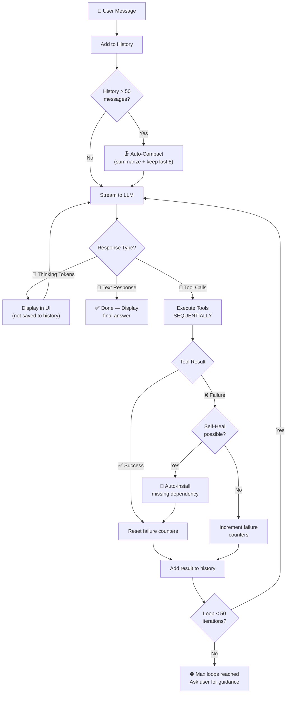

#### Key Design Decisions

| Decision | Rationale |
|----------|-----------|
| **Sequential tool execution** | `Promise.all()` causes race conditions where tool results push to `this.messages` in random order, corrupting conversation history. |
| **50 loop limit** | Complex multi-step tasks (exploit → pivot → escalate) require many iterations. 50 is the sweet spot between flexibility and safety. |
| **Thinking tokens excluded from history** | Chain-of-thought `<think>` tokens are displayed to the user but NOT saved, reducing token bloat on subsequent API calls. |
| **Auto-compaction at 50 messages** | Deep reasoning APIs slow down quadratically with large contexts. Compaction keeps the last 8 messages + a summary. |

#### Message History Management

```
┌────────────────────────────────────────────────┐
│              Message History                    │
├────────────────────────────────────────────────┤
│  [user]      "Scan example.com"                │
│  [assistant] null (tool_calls: [nmap_scan])     │
│  [tool]      {success: true, ports: [...]}     │
│  [assistant] null (tool_calls: [nuclei_scan])   │
│  [tool]      {success: true, vulns: [...]}     │
│  [assistant] "Found 3 vulnerabilities..."       │  ← Final response
├────────────────────────────────────────────────┤
│  After compaction (>50 msgs):                  │
│  [user]      "[Summary: 12 turns, 48 msgs...]" │
│  [assistant] "Understood. How can I help?"     │
│  ... last 8 messages preserved ...             │
└────────────────────────────────────────────────┘
```

---

### 2. API Layer — NVIDIA NIM Integration

**File**: `src/api.js` (294 lines)

Handles all communication with the NVIDIA NIM API using **Server-Sent Events (SSE)** for real-time streaming.

#### Request Flow

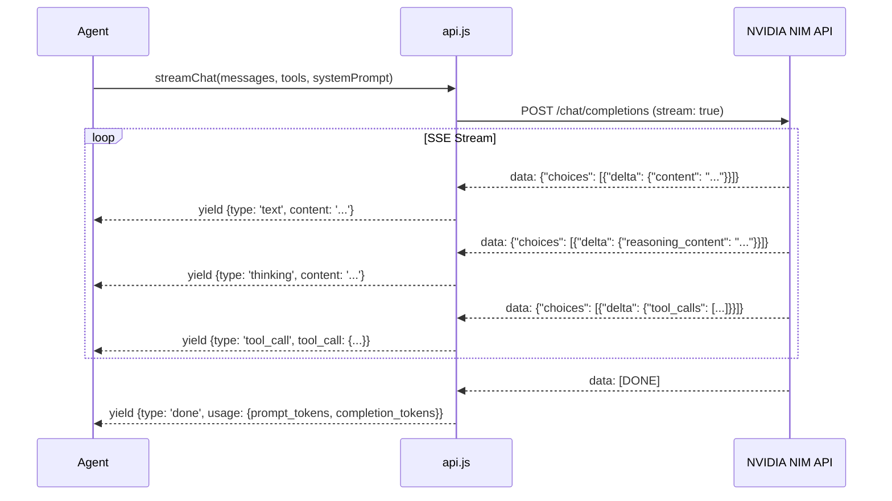

#### Key Features

| Feature | Implementation |
|---------|---------------|
| **Model** | `z-ai/glm-5.1` (NVIDIA NIM hosted) — supports native chain-of-thought reasoning tokens |
| **Retry Logic** | Exponential backoff for 429 (rate limit): `3s × attempt`. Up to 10 retries for network failures |
| **Timeouts** | 30-minute hard timeout for chat completions, 5-second timeout for health checks |
| **JSON Sanitization** | Broken JSON from interrupted streams is sanitized to `{"_error": "..."}` to prevent 400 errors |
| **Tool Deduplication** | Duplicate tool calls on the `[DONE]` signal are filtered out |
| **Token Tracking** | `prompt_tokens` and `completion_tokens` accumulated per session for cost monitoring |

---

### 3. Tool Execution Pipeline

**File**: `src/tools/index.js` + 30 tool files

Every tool call goes through a strict pipeline before execution:

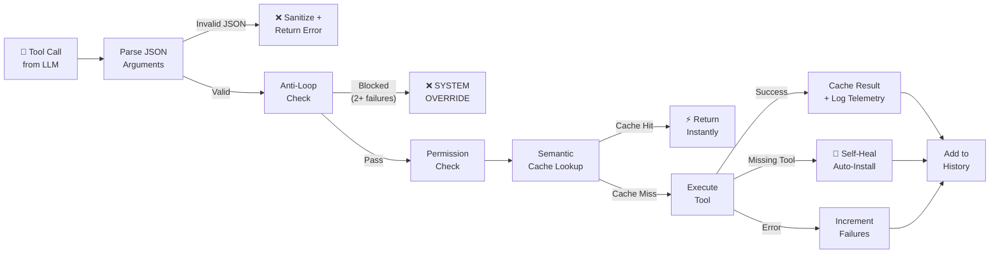

#### Tool Categories & Permission Model

```
┌─────────────────────────────────────────────┐
│          TOOL PERMISSION TIERS              │
├─────────────────────────────────────────────┤
│  READ (auto-approved)                       │
│  ├── read_file, list_directory, search_*    │
│  ├── web_search, read_url, cve_lookup       │
│  └── shodan_search, dns_recon, whois_lookup │
├─────────────────────────────────────────────┤
│  WRITE (auto-approved in uncensored mode)   │
│  ├── write_file, edit_file, save_artifact   │
│  └── memory_store                           │
├─────────────────────────────────────────────┤
│  EXECUTE (auto-approved in uncensored mode) │
│  ├── execute_command, bg_interact           │
│  ├── start_listener, install_tool           │
│  ├── stealth_browser, metasploit_rpc        │
│  └── spawn_subagent                         │
└─────────────────────────────────────────────┘
```

> **Note**: In production mode (uncensored=false), WRITE and EXECUTE tools prompt the user for approval. In the default uncensored mode, all tools are auto-approved for maximum autonomy.

---

### 4. MCP Server — Model Context Protocol

**File**: `src/mcp-server.js` (262 lines)

The MCP server dynamically exposes **every installed Kali tool** as an MCP tool, enabling any MCP-compatible AI client to use Jarvis as a cybersecurity backend.

#### Architecture

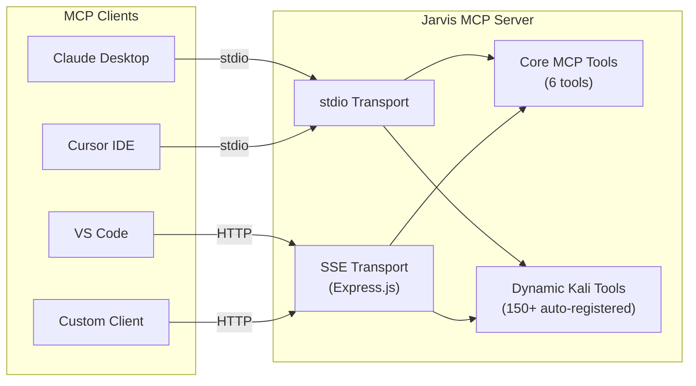

#### Transport Comparison

| Transport | Protocol | Use Case | Endpoint |
|-----------|----------|----------|----------|
| **stdio** | stdin/stdout pipes | Local clients on same machine | N/A (piped) |
| **SSE** | HTTP + Server-Sent Events | Remote clients, multi-user | `GET /sse`, `POST /messages` |

#### Dynamic Tool Registration Process

```
1. Read kali-tools-registry.js → 150+ tool definitions
2. Call detectInstalledTools() → check which binaries exist on PATH
3. For each installed tool:
   a. Generate MCP tool name: kali_{tool_name}
   b. Build Zod schema: { args, target, timeout_ms }
   c. Register handler that:
      - Builds command dynamically
      - Auto-installs if missing on first call
      - Rewrites sudo → sudo -n
      - Executes via execSync
      - Logs telemetry to Tool Bridge
```

---

### 5. Tool Bridge — Runtime Service Discovery

**File**: `src/tool-bridge.js` (278 lines)

The Tool Bridge is a **runtime service discovery layer** that detects running security tool services and automatically configures the agent.

#### Service Detection Flow

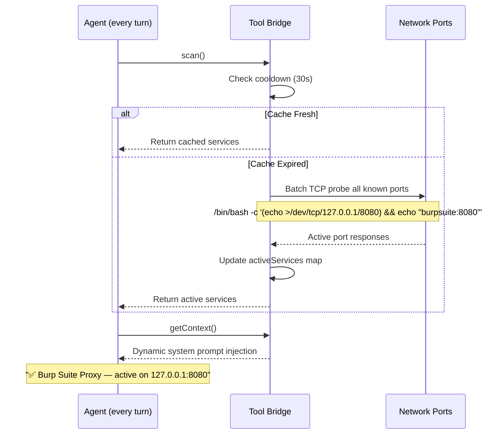

#### Auto-Detected Services

```
┌─────────────────────────────────────────────────────────┐
│                  SERVICE REGISTRY                        │
├───────────────────┬──────┬──────────┬───────────────────┤
│ Service           │ Port │ Type     │ Auto-Action       │
├───────────────────┼──────┼──────────┼───────────────────┤
│ Burp Suite Proxy  │ 8080 │ HTTP     │ Route all traffic │
│ OWASP ZAP         │ 8090 │ HTTP     │ Route all traffic │
│ mitmproxy         │ 8081 │ HTTP     │ Route all traffic │
│ Metasploit RPC    │55553 │ RPC      │ Enable msf_rpc    │
│ Burp Suite MCP    │ 9876 │ MCP      │ Connect MCP       │
│ Collaborator      │ 9090 │ OOB      │ OOB interactions  │
│ Interactsh        │ 8553 │ OOB      │ OOB interactions  │
└───────────────────┴──────┴──────────┴───────────────────┘

Proxy Priority: Burp Suite > ZAP > mitmproxy
```

#### Telemetry System

Every tool execution is logged with:
- Tool name and arguments
- Success/failure status
- Duration in milliseconds
- MITRE ATT&CK technique mapping
- Timestamp

This data feeds into the **Report Engine** for automatic pentest report generation.

---

### 6. Dynamic Strategy Engine

**File**: `src/dynamic-skills.js` (235 lines) + `src/frameworks.js` (700+ lines)

Unlike traditional security tools that use hardcoded playbooks, Jarvis generates attack strategies **dynamically** based on the target environment.

#### Strategy Generation Flow

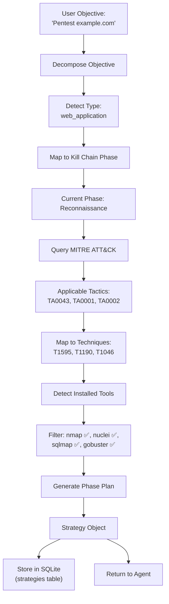

#### Supported Objective Types

| Objective Type | Detection Pattern | Phases |
|---|---|---|
| Full Penetration Test | `exploit`, `hack`, `penetrat` | recon → vuln → exploit → post-exploit → report |
| Web Application | `webapp`, `http`, `sql injection` | web_recon → tech_detect → crawl → fuzz → exploit |
| Active Directory | `active dir`, `kerberos`, `ldap` | ad_enum → user_hunt → cred_access → lateral → domain_admin |
| Wireless | `wifi`, `wpa`, `aircrack` | interface_setup → discovery → capture → cracking |
| Cloud | `aws`, `azure`, `s3`, `kubernetes` | cloud_recon → bucket_enum → iam → metadata → exploit |
| Privilege Escalation | `privesc`, `root`, `escalat` | sys_enum → vuln_id → exploit_select → escalation |
| Social Engineering | `phish`, `social`, `vish` | profiling → pretext → campaign → execution → harvest |
| Reverse Engineering | `malware`, `binary`, `disassembl` | static → dynamic → behavioral → deobfuscation → report |
| Network Pentest | `network`, `internal`, `pivot` | net_map → host_discover → service_enum → vuln_scan → exploit → pivot |
| Reconnaissance | `recon`, `scan`, `enumerate` | passive → active → enumeration → analysis |

---

### 7. Report Engine

**File**: `src/report-engine.js` (400+ lines)

Automatically generates structured penetration test reports from the Tool Bridge's telemetry data.

#### Report Generation Flow

```
┌──────────────────┐     ┌──────────────────┐     ┌──────────────────────┐
│  Tool Bridge     │────>│  Report Engine    │────>│  Markdown Report     │
│  Execution Log   │     │  (report-engine)  │     │  (jarvis-output/)    │
│                  │     │                   │     │                      │
│  • tool name     │     │  • Classify into  │     │  1. Executive Summary│
│  • args          │     │    KC phases      │     │  2. Methodology      │
│  • result        │     │  • Detect vulns   │     │  3. Findings (rated) │
│  • duration      │     │  • Map MITRE IDs  │     │  4. Tool Breakdown   │
│  • MITRE ID      │     │  • Calculate stats│     │  5. MITRE Mapping    │
│  • timestamp     │     │  • Generate MD    │     │  6. Timeline         │
└──────────────────┘     └──────────────────┘     │  7. Recommendations  │
                                                   └──────────────────────┘
```

#### Vulnerability Auto-Classification

The engine pattern-matches tool output for common vulnerability indicators:

| Pattern | Classification | Severity |
|---------|---------------|----------|
| `SQL injection`, `SQLi` | SQL Injection | Critical |
| `XSS`, `cross-site scripting` | Cross-Site Scripting | High |
| `remote code execution`, `RCE` | RCE | Critical |
| `directory traversal`, `path traversal` | Path Traversal | High |
| `open port`, `service detected` | Information Disclosure | Info |

---

### 8. Subagent System

**File**: `src/subagent-manager.js` (100 lines) + `src/tools/subagent-tools.js`

Enables the main agent to **delegate tasks** to background AI agents that run independently.

#### Subagent Lifecycle

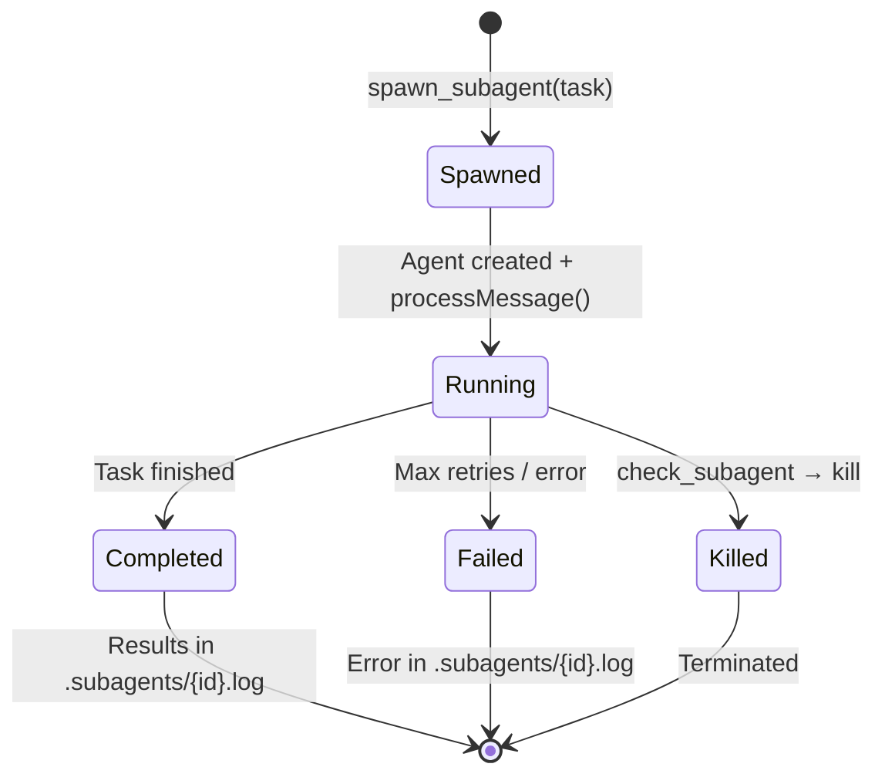

#### Architecture

```
Main Agent
├── spawn_subagent("Enumerate subdomains of target.com")
│   └── Subagent #1 (background)
│       ├── Has full access to all 35 tools
│       ├── Runs in separate Agent instance
│       ├── Writes results to .subagents/sub_1718000000_abc.log
│       └── Status: running | completed | failed
│
├── spawn_subagent("Brute-force SSH on 192.168.1.5")
│   └── Subagent #2 (background)
│
└── check_subagent_status(id) → Read results
```

---

### 9. Auto-Learner — Threat Intelligence (MAXED — 28+ Sources)

**File**: `src/auto-learner.js` (1400+ lines)

A continuously running intelligence engine that fetches, processes, and stores cybersecurity data from **28+ global threat feeds**. Fetches **10,000+ items per run** with maximum limits. Includes an **Attack Memory Feedback Loop** that learns from Jarvis's own operations.

#### Data Sources & Pipeline

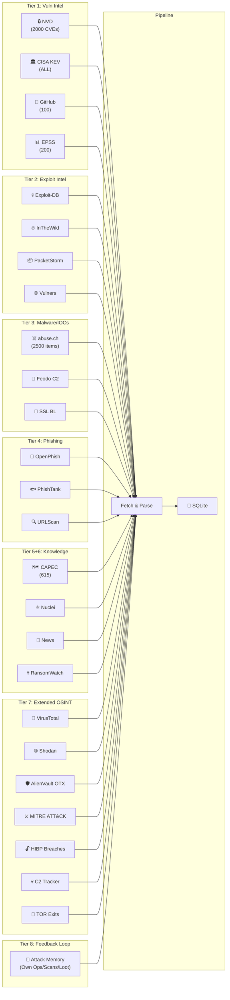

#### Learning Schedule (28+ Sources)

| # | Source | Frequency | Max Items | Data Type |
|---|--------|-----------|-----------|-----------|
| 1 | NVD API | Hourly | 2,000 | CVE records (7-day window) |
| 2 | CISA KEV | Daily | **ALL** (~1,100+) | Known exploited vulnerabilities |
| 3 | GitHub Advisories | Hourly | 100 | Security advisories with CVSS |
| 4 | FIRST.org EPSS | Daily | 200 | Exploit prediction scores |
| 5 | Exploit-DB | Hourly | 200 | Exploits (GitLab API + RSS) |
| 6 | InTheWild.io | Daily | 500 | Actively exploited CVEs |
| 7 | PacketStorm Security | Hourly | RSS | Latest exploits |
| 8 | Vulners.com | Hourly | 200 | Vulnerability bulletins |
| 9 | abuse.ch Malware Bazaar | Hourly | 1,000 | Malware samples/hashes |
| 10 | abuse.ch URLhaus | Hourly | 500 | Malicious URLs |
| 11 | abuse.ch ThreatFox | Hourly | 1,000 | IOC indicators |
| 12 | Feodo Tracker | Daily | All | Botnet C2 server IPs |
| 13 | SSL Blacklist | Daily | All | Malicious SSL certificates |
| 14 | OpenPhish | Daily | ~300 | Active phishing URLs |
| 15 | PhishTank | Daily | 500 | Community-verified phishing |
| 16 | URLScan.io | Hourly | 100 | Recent phishing scans |
| 17 | MITRE CAPEC | Once | 615 | Attack pattern catalog |
| 18 | Nuclei Templates | Daily | 100 commits | CVE detection templates |
| 19 | HackerNews | Hourly | 50 | Security news stories |
| 20 | CISA Alerts | Daily | 100 | Official advisories |
| 21 | RansomWatch | Daily | 500 | Ransomware group posts |
| 22 | **VirusTotal** | Hourly | 30+ | Malware files, threat categories, community intel |
| 23 | **Shodan** | Hourly | 100+ | Exploit search, honeypot data |
| 24 | **AlienVault OTX** | Daily | 50 pulses + IOCs | Threat pulses, community IOCs |
| 25 | **MITRE ATT&CK** | Once | 700+ | Enterprise techniques + APT groups |
| 26 | **Have I Been Pwned** | Daily | All | Complete breach catalog |
| 27 | **C2 Tracker** | Daily | 500+ | Cobalt Strike, Metasploit, Havoc, Sliver C2 IPs |
| 28 | **TOR Exit Nodes** | Daily | 1,000+ | Active TOR exit node IPs |
| 29 | **Attack Memory** | Hourly | All | Own operations, scans, attack chains, loot |
| | **TOTAL PER RUN** | | **~10,000+** | |


---

### 10. Persistent Memory — SQLite

**File**: `src/memory.js` (796 lines)

All persistent data is stored in a local SQLite database (`jarvis-memory.db`) using `better-sqlite3` for synchronous, high-performance access. The database contains **15+ tables** covering knowledge, targets, chat sessions, conversations, cache, operations, scan results, threat intel, FOFA results, exploit DB, attack logs, strategies, and more.

#### Database Schema

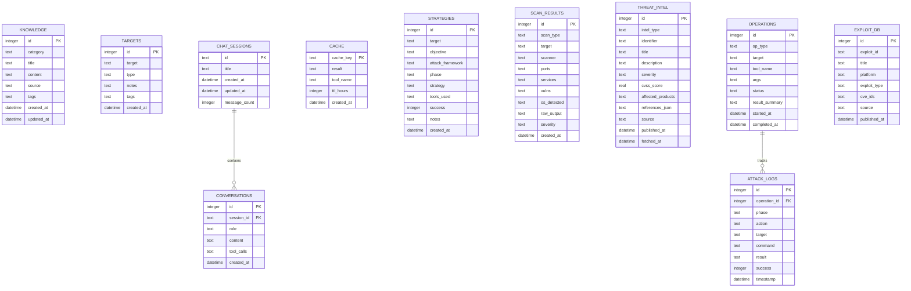

#### Key Operations

| Operation | Method | Description |
|-----------|--------|-------------|
| `storeKnowledge()` | INSERT | Store learned intelligence (CVEs, exploits, IOCs) |
| `searchKnowledge()` | SELECT + LIKE | Full-text search across all knowledge |
| `cacheResult()` | INSERT/REPLACE | Cache tool results with TTL |
| `getCached()` | SELECT | Retrieve cached result if not expired |
| `storeTarget()` | INSERT | Save target information |
| `getTargetHistory()` | SELECT | Retrieve all data for a target |

---

### 11. Telegram Bot Interface

**File**: `src/telegram-bot.js` (1100+ lines)

A full-featured Telegram bot that provides remote control of Jarvis with rich message formatting, inline keyboards, and per-user agent sessions.

#### Architecture

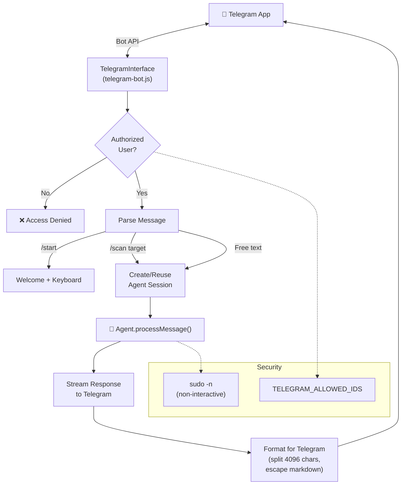

#### Key Features

- **Per-user sessions**: Each authorized user gets their own `Agent` instance
- **Message splitting**: Telegram has a 4096-character limit; messages are split intelligently
- **Inline keyboards**: Quick-access buttons for common actions
- **Photo/document support**: Receive and process files via Telegram
- **Auto-sudo**: All `sudo` commands rewritten to `sudo -n` to prevent password prompts

---

### 12. Web UI Command Center

**File**: `src/web-server.js` (653 lines) + `public/` (frontend)

The Web UI is a full-featured browser-based command center that provides real-time interaction with the Jarvis agent via WebSocket, along with comprehensive system monitoring and management.

#### Architecture

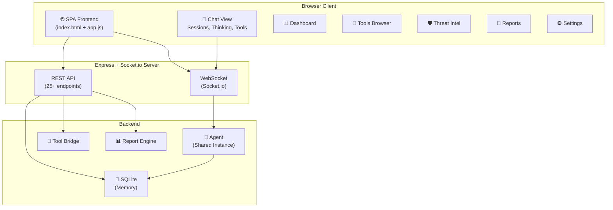

#### Frontend Views

| View | File | Features |
|------|------|----------|
| **Dashboard** | `views/dashboard.js` | System health, API status, active services, DB stats |
| **Agent Chat** | `views/chat.js` (1160 lines) | Real-time streaming, thinking visualization, tool cards, session sidebar, search, slash commands |
| **Tools** | `views/tools.js` | Browse 150+ Kali + 35 API tools, install status, category filter |
| **Threat Intel** | `views/intel.js` | CVE browser, exploit search, intel counts |
| **Reports** | `views/reports.js` | Report list, download, view |
| **Settings** | `views/settings.js` | Model, temperature, topP, maxTokens configuration |

#### WebSocket Chat Flow

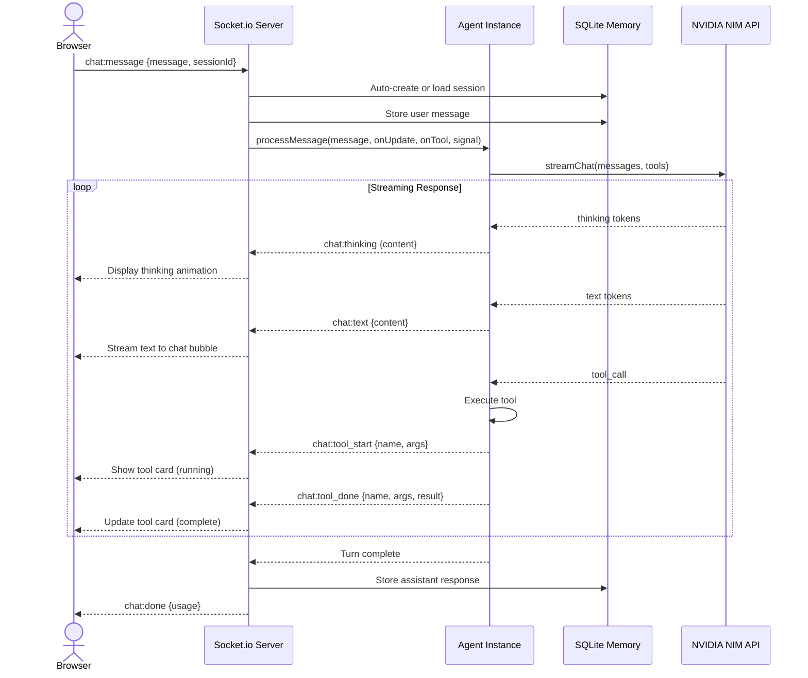

#### Chat Session Management

```
┌─────────────────────────────────────────────────────────────┐
│                  CHAT SESSION LIFECYCLE                      │
├─────────────────────────────────────────────────────────────┤
│  1. User sends first message → Auto-create session          │
│  2. Title = first 60 chars of first message                 │
│  3. All messages stored in conversations table (FK)         │
│  4. Session sidebar shows history (sorted by updated_at)    │
│  5. Click session → Load messages + restore agent history   │
│  6. Search across session titles and message content        │
│  7. Delete session → Cascade delete all messages            │
│  8. Abort → AbortController cancels in-flight generation    │
└─────────────────────────────────────────────────────────────┘
```

#### REST API Summary

| Category | Endpoints | Description |
|----------|-----------|-------------|
| **System** | `/api/health`, `/api/stats`, `/api/config` | Health, DB stats, configuration |
| **Tools** | `/api/tools`, `/api/kali-tools`, `/api/frameworks` | Tool definitions, install status |
| **Intelligence** | `/api/threat-intel`, `/api/exploits/search`, `/api/knowledge` | Threat data queries |
| **Operations** | `/api/scan-results`, `/api/operations`, `/api/targets`, `/api/loot` | Scan data, ops log |
| **Chat** | `/api/chat/sessions` (CRUD), `/api/chat/search` | Session management |
| **Reports** | `/api/report`, `/api/reports-list`, `/api/reports/download` | Report generation |
| **Monitoring** | `/api/services`, `/api/usage-stats`, `/api/execution-log` | Service discovery, telemetry |

---

## 🔄 Data Flow Diagrams

### Complete Request Lifecycle

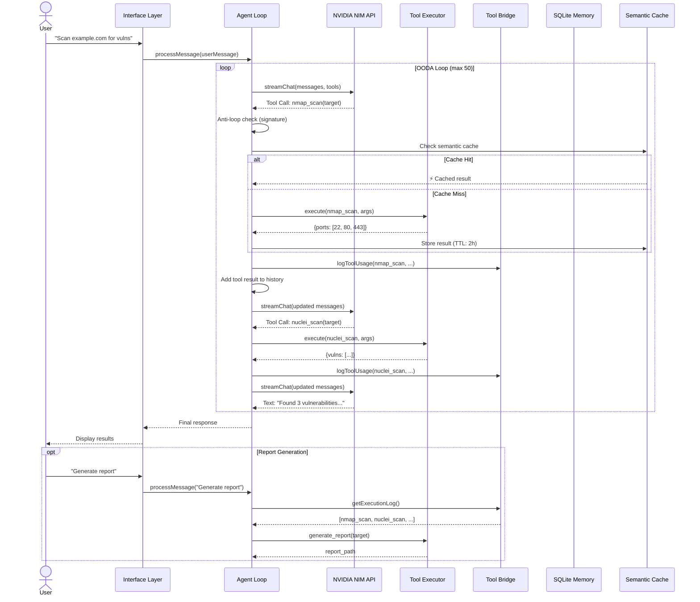

---

## 🛡️ Anti-Loop Intelligence

The anti-loop system prevents the agent from getting stuck in infinite failure cycles. It operates at three levels:

### Level 1: Signature Tracking

```
Tool Call: execute_command("python exploit.py")
  → Hash signature: "execute_command:{'command':'python exploit.py'}"
  → Attempt 1: Failed ❌ (counter = 1)
  → Attempt 2: Failed ❌ (counter = 2)
  → Attempt 3: BLOCKED 🚫 "SYSTEM OVERRIDE — change approach"
```

### Level 2: Consecutive Failure Cap

```
Tool Call #1: nmap → Failed ❌ (consecutive = 1)
Tool Call #2: nuclei → Failed ❌ (consecutive = 2)
...
Tool Call #15: gobuster → Failed ❌ (consecutive = 15)
Tool Call #16: BLOCKED 🚫 "15 consecutive failures — ask user for help"
```

### Level 3: Dynamic Retry Reset

```
Tool Call: python exploit.py → Failed ❌ (signature tracked)
Tool Call: write_file(exploit.py, fixed_code) → Success ✅
  → 🔄 ALL failure signatures CLEARED
  → Agent can now retry "python exploit.py"
```

### Soft Failure Exclusion

These are NOT counted as failures:

| Scenario | Reason |
|----------|--------|
| `nmap` timeout | Scanning is inherently slow |
| `grep` exit code 1 | "No match" is information, not failure |
| `pkill` exit code 1 | "No process" is expected behavior |
| `check_port` closed | Port status is intelligence |
| `aircrack-ng` exit 124 | WiFi capture tools exit non-zero normally |

---

## ⚡ Semantic Execution Cache

The cache prevents redundant reconnaissance scans by storing results with configurable TTL:

```
┌────────────────────────────────────────────────────────────────┐
│                    SEMANTIC CACHE                               │
├────────────────────┬──────┬────────────────────────────────────┤
│ Tool Type          │ TTL  │ Cache Key Format                   │
├────────────────────┼──────┼────────────────────────────────────┤
│ DNS/WHOIS/CVE      │ 24h  │ exec_cache:dns_recon:{args_json}  │
│ Port scans (nmap)  │ 2h   │ exec_cache:execute_command:{args} │
│ Vuln scans (nuclei)│ 2h   │ exec_cache:execute_command:{args} │
│ Shodan/FOFA        │ 24h  │ exec_cache:shodan_search:{args}   │
│ Wayback Machine    │ 24h  │ exec_cache:wayback_machine:{args} │
└────────────────────┴──────┴────────────────────────────────────┘

Cache Lookup:
  1. Compute key = "exec_cache:{tool}:{JSON.stringify(args)}"
  2. SELECT FROM cache WHERE key = ? AND expires_at > datetime('now')
  3. If found → return instantly (⚡ CACHE HIT)
  4. If not → execute tool, then INSERT result with TTL
```

---

## 🔄 Self-Healing Error Recovery

When a command fails due to a missing dependency, Jarvis auto-recovers:

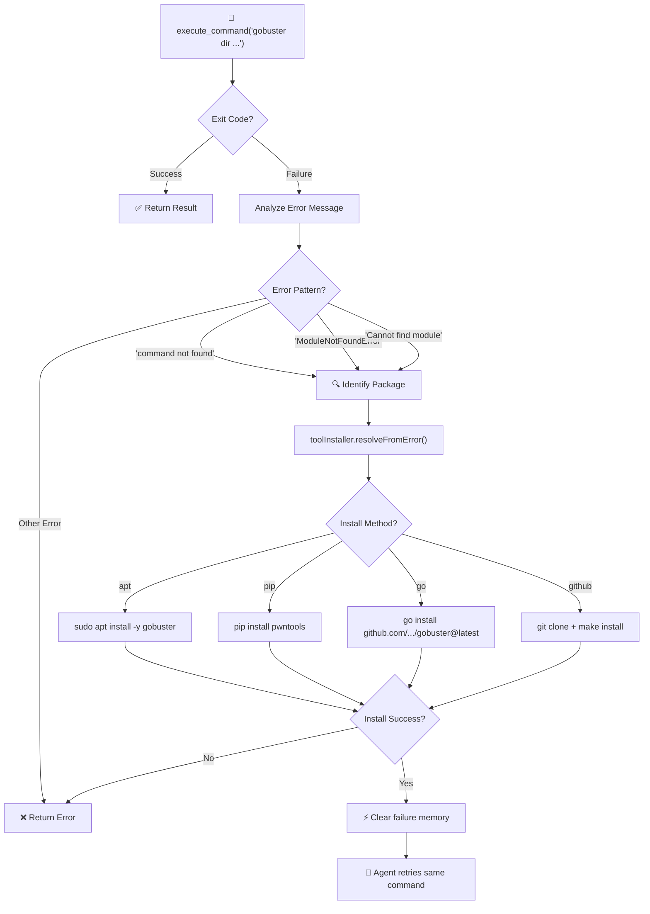

### Install Method Priority

| Method | Source | Speed | Reliability |
|--------|--------|-------|-------------|
| `apt` | Kali/Debian repos | Fast | ⭐⭐⭐⭐⭐ |
| `pip` | PyPI | Fast | ⭐⭐⭐⭐ |
| `go` | Go modules | Medium | ⭐⭐⭐⭐ |
| `npm` | npm registry | Fast | ⭐⭐⭐⭐ |
| `gem` | RubyGems | Fast | ⭐⭐⭐ |
| `cargo` | crates.io | Slow | ⭐⭐⭐ |
| `github` | Clone + build | Slow | ⭐⭐ |
| `url` | Direct download | Fast | ⭐⭐ |

---

## 🎯 MITRE ATT&CK & Cyber Kill Chain Integration

**File**: `src/frameworks.js` (700+ lines)

Jarvis integrates two industry-standard frameworks for structured offensive operations:

### Cyber Kill Chain Mapping

```
Phase 1: RECONNAISSANCE (TA0043)
│   Tools: nmap, masscan, subfinder, amass, theHarvester
│   Goal:  Target research, OSINT, network mapping
│
Phase 2: WEAPONIZATION (TA0042)
│   Tools: msfvenom, searchsploit
│   Goal:  Payload generation, C2 setup, exploit preparation
│
Phase 3: DELIVERY (TA0001)
│   Tools: setoolkit, gophish, nuclei
│   Goal:  Exploit delivery via web, phishing, social engineering
│
Phase 4: EXPLOITATION (TA0002)
│   Tools: metasploit, sqlmap, nuclei, crackmapexec
│   Goal:  Code execution, vulnerability exploitation
│
Phase 5: INSTALLATION (TA0003, TA0004)
│   Tools: linpeas, winpeas, seatbelt
│   Goal:  Persistence, privilege escalation, backdoors
│
Phase 6: COMMAND & CONTROL (TA0011)
│   Tools: chisel, proxychains, socat
│   Goal:  Encrypted C2, tunneling, pivoting
│
Phase 7: ACTIONS ON OBJECTIVES (TA0007-TA0010)
│   Tools: bloodhound, impacket, crackmapexec
│   Goal:  Lateral movement, exfiltration, credential harvesting
```

### Technique ID Mapping (Per Tool)

Every tool execution is tagged with its MITRE ATT&CK technique:

```javascript
// From tool-bridge.js _mapToMitre()
nmap      → T1046  (Network Service Scanning)
sqlmap    → T1190  (Exploit Public-Facing Application)
hydra     → T1110  (Brute Force)
bloodhound → T1087 (Account Discovery)
chisel    → T1572  (Protocol Tunneling)
msfvenom  → T1587  (Develop Capabilities)
responder → T1557  (Adversary-in-the-Middle)
linpeas   → T1068  (Exploitation for Privilege Escalation)
```

---

## 🔐 Security Architecture

### Dangerous Command Filtering

```javascript
// From config.js — dangerousPatterns
const BLOCKED_PATTERNS = [
    /rm\s+-rf\s+\//,        // Recursive root deletion
    /mkfs/,                  // Filesystem formatting
    /dd\s+if=.*of=\/dev/,   // Raw disk writes
    /:(){ :\|:& };:/,       // Fork bombs
    /powershell\s+-enc/,     // Encoded PowerShell (in non-pentest context)
];
```

### Sudo Non-Interactive Fix

All `sudo` commands are automatically rewritten:

```
Input:  sudo nmap -sS 192.168.1.0/24
Output: sudo -n nmap -sS 192.168.1.0/24
                  ^^ non-interactive flag
```

This prevents the Telegram bot and daemon from hanging on password prompts.

### API Key Security

- `.env` file is in `.gitignore` — never committed
- API keys are loaded via `dotenv` at startup
- Keys are validated at config load time
- Telegram bot requires `TELEGRAM_ALLOWED_IDS` whitelist

### Result Truncation

Tool outputs are truncated to prevent token bloat and potential information leakage:

| Field | Max Length | Purpose |
|-------|-----------|---------|
| `stdout` | 4,000 chars | Prevent sending huge outputs to API |
| `content` | 4,000 chars | Limit file read sizes |
| `listing` | 3,000 chars | Limit directory listings |
| `results` | 50 items | Limit array results |
| **Total** | **8,000 chars** | **Hard cap per tool result** |

---

## ⚙️ Configuration System

**File**: `src/config.js`

### Environment Variables

```bash
# ═══ REQUIRED ═══
NVIDIA_API_KEY=your-nvidia-nim-api-key

# ═══ AI Model ═══
AI_MODEL=z-ai/glm-5.1                 # Default model
AI_BASE_URL=https://integrate.api.nvidia.com/v1  # API endpoint
MAX_TOKENS=16384                       # Max output tokens
TEMPERATURE=0.6                        # Sampling temperature

# ═══ Telegram ═══
TELEGRAM_BOT_TOKEN=your-bot-token
TELEGRAM_ALLOWED_IDS=123456789,987654321

# ═══ Search APIs ═══
SHODAN_API_KEY=your-shodan-key
TAVILY_API_KEY=your-tavily-key
VIRUSTOTAL_API_KEY=your-vt-key
FOFA_EMAIL=your-email
FOFA_API_KEY=your-fofa-key
PDCP_API_KEY=your-pdcp-key

# ═══ Proxy Configuration ═══
BURP_PROXY=127.0.0.1:8080
ZAP_PROXY=127.0.0.1:8090

# ═══ Auto-Learning ═══
LEARNING_CRON=0 */6 * * *             # Every 6 hours
```

### Configuration Hierarchy

```
1. Environment variables (.env file)
2. CLI arguments (--model, --url, --auto-approve)
3. Default values (hardcoded in config.js)

Priority: CLI args > env vars > defaults
```

### Environment File Loading

```
1. Check for .env in current working directory (CWD)
2. If not found, check in package directory (where cli.js lives)
3. For global installations (npm link), store data in ~/.jarvis/
4. For local installations, store data in project directory
```

---

## 🏢 Deployment Architectures

### Local Development

```
┌─────────────────────────────┐
│      Developer Machine      │
│  ┌───────┐  ┌────────────┐  │
│  │ Jarvis│──│ NVIDIA NIM │──── Internet
│  │  CLI  │  │   API      │  │
│  └───┬───┘  └────────────┘  │
│      │                      │
│  ┌───┴───────────────┐      │
│  │  Target Network   │      │
│  │  (local/lab VMs)  │      │
│  └───────────────────┘      │
└─────────────────────────────┘
```

### Daemon Mode (24/7)

```
┌──────────────────────────────────────────┐
│           Kali Linux Server              │
│                                          │
│  ┌──────────┐  ┌─────────────────────┐   │
│  │ systemd  │──│ Jarvis Daemon       │   │
│  │ service  │  │ ├── Telegram Bot    │   │
│  └──────────┘  │ ├── Auto-Learner    │   │
│                │ ├── Heartbeat Queue  │   │
│                │ └── Agent (on-demand)│   │
│                └──────────┬──────────┘   │
│                           │              │
│  ┌────────────────────────┤              │
│  │ SQLite DB              │              │
│  │ (persistent memory)    │              │
│  └────────────────────────┘              │
│                           │              │
│  ┌────────────────────────┤              │
│  │  📱 Telegram           │              │
│  │  (remote control)  ────── Internet    │
│  └────────────────────────┘              │
└──────────────────────────────────────────┘
```

### MCP Server Mode

```
┌───────────────────────────────────────────────┐
│               AI Client Machine               │
│  ┌───────────────┐  ┌──────────────────────┐  │
│  │ Claude Desktop│  │ Cursor IDE           │  │
│  │   (MCP client)│  │   (MCP client)       │  │
│  └───────┬───────┘  └──────────┬───────────┘  │
│          │    stdio            │    stdio      │
│          └──────────┬──────────┘              │
│                     │                         │
│         ┌───────────┴───────────┐             │
│         │ Jarvis MCP Server     │             │
│         │ (150+ Kali tools)     │             │
│         └───────────┬───────────┘             │
│                     │                         │
│         ┌───────────┴───────────┐             │
│         │ Kali Linux System     │             │
│         │ (nmap, sqlmap, etc.)  │             │
│         └───────────────────────┘             │
└───────────────────────────────────────────────┘


┌──── Remote SSE Mode ────┐     ┌──── Kali Server ────────┐
│ Web Client / VS Code    │     │ Jarvis MCP SSE Server   │
│ Custom MCP Client       ├────>│ GET  /sse               │
│                         │     │ POST /messages           │
│                         │     │ GET  /health             │
└─────────────────────────┘     └─────────────────────────┘
```

---

## 📋 Appendix: npm Scripts

| Script | Command | Description |
|--------|---------|-------------|
| `start` | `node cli.js` | Start interactive CLI |
| `dev` | `node cli.js --verbose` | CLI with verbose logging |
| `web` | `node cli.js --web` | Web UI Command Center (port 3000) |
| `web:dev` | `node cli.js --web --port 3000` | Web UI on custom port |
| `telegram` | `node cli.js --telegram` | Telegram bot mode |
| `daemon` | `node cli.js --daemon` | Background daemon |
| `learn` | `node cli.js --learn` | Single learning cycle |
| `mcp` | `node cli.js --mcp` | MCP server (stdio) |
| `mcp:sse` | `node cli.js --mcp --port 8888` | MCP server (SSE) |
| `install-service` | `./install-service.sh` | Install systemd service |
| `test` | `node tests/test-all.js` | Run test suite |

> **CLI shorthand**: `jarvis -ui` or `jarvis --ui` is an alias for `jarvis --web` for quick access to the Web UI.

---

## 📋 Appendix: Dependencies

| Package | Version | Purpose |
|---------|---------|---------|
| `@modelcontextprotocol/sdk` | ^1.29.0 | MCP server implementation |
| `axios` | ^1.14.0 | HTTP client for API calls |
| `better-sqlite3` | ^12.8.0 | Synchronous SQLite driver |
| `chalk` | ^5.3.0 | Terminal colors |
| `cheerio` | ^1.2.0 | HTML parsing (read_url, auto-learner) |
| `diff` | ^5.2.0 | File diff for edit_file tool |
| `dotenv` | ^17.3.1 | Environment variable loading |
| `duck-duck-scrape` | ^2.2.7 | DuckDuckGo search scraping |
| `express` | ^5.2.1 | Web UI server + SSE transport HTTP server |
| `socket.io` | ^4.8.3 | Real-time WebSocket communication for Web UI |
| `glob` | ^10.3.10 | File pattern matching |
| `marked` + `marked-terminal` | ^12.0 / ^7.0 | Markdown rendering in terminal |
| `node-cron` | ^3.0.3 | Cron scheduling for daemon/auto-learner |
| `node-telegram-bot-api` | ^0.67.0 | Telegram Bot API wrapper |
| `ora` | ^8.0.1 | Terminal spinner animations |
| `puppeteer` | ^24.9.0 | Headless browser (stealth_browser tool) |
| `whois-json` | ^2.0.4 | WHOIS lookup integration |
| `zod` | ^4.4.3 | Schema validation (MCP tool params) |

---

<p align="center">
  <strong>🐉 Jarvis Cyber v4.0 — Architecture & Technical Deep-Dive</strong><br>
  <em>Built by <a href="https://github.com/ABINAYAN-HUB">ABINAYAN</a></em>
</p>
